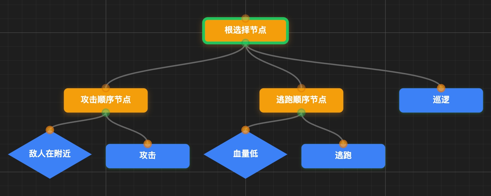
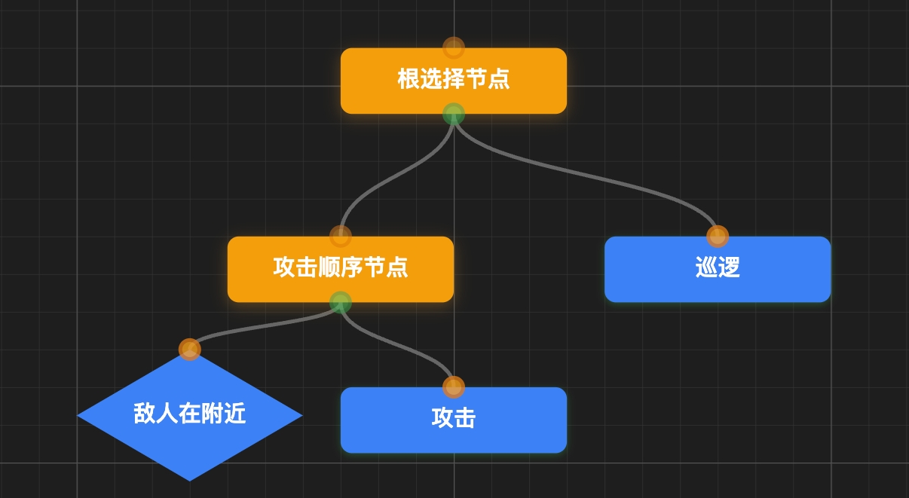
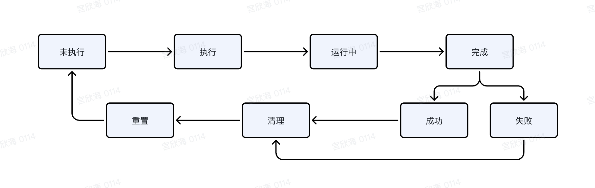
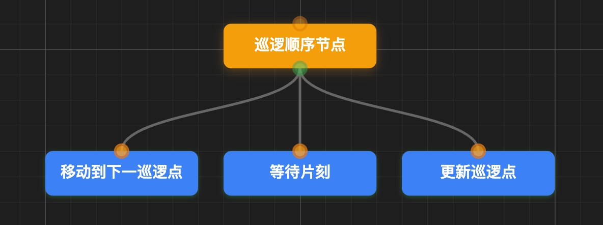
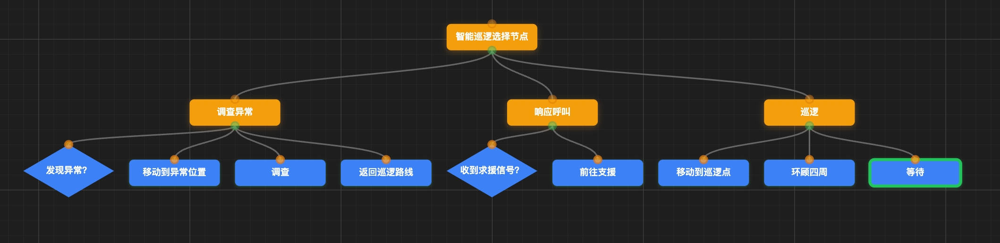
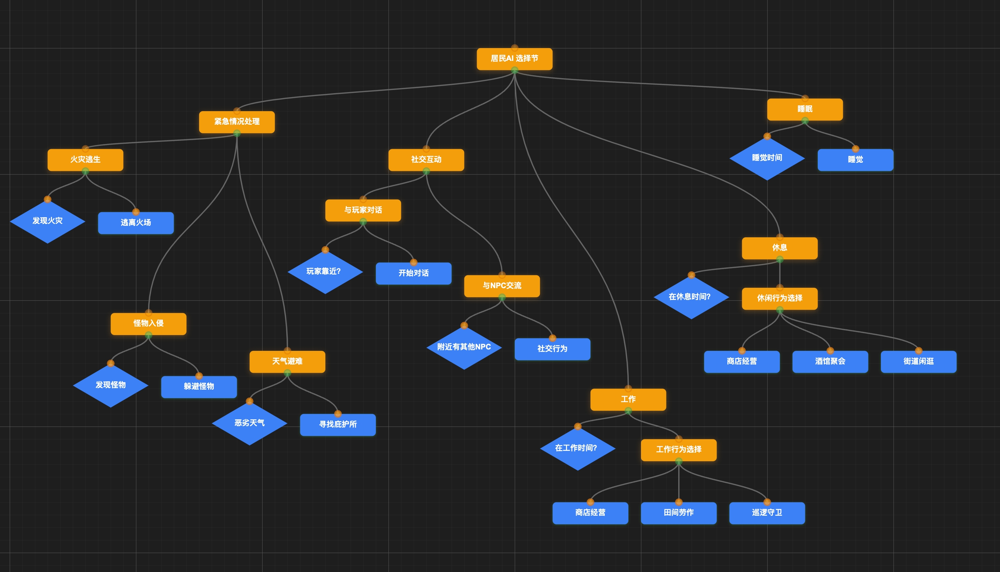
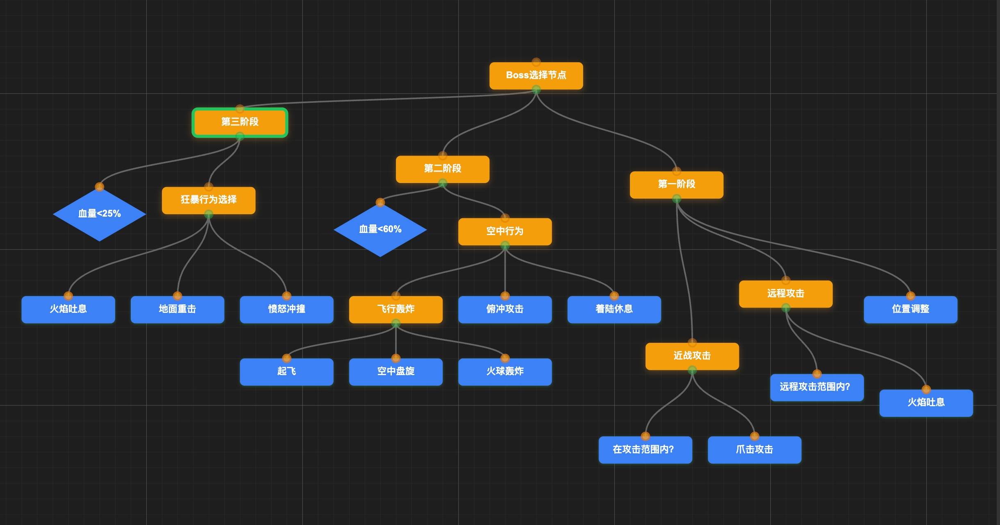

# 行为树深度解析


## 下载地址

#### github仓库: [https://github.com/gongxh0901/kunpocc-behaviortree](https://github.com/gongxh0901/kunpocc-behaviortree)

#### 可视化工具地址: 敬请期待


## 第一部分：基础概念篇

### 1.1 什么是行为树？

#### 1.1.1 从有限状态机的局限性说起

在游戏AI开发中，有限状态机（FSM）曾经是主流的解决方案。想象一个简单的NPC守卫：

```
巡逻 → 发现敌人 → 追击 → 失去目标 → 返回巡逻
```

这看起来很直观，但当行为变得复杂时，问题就出现了：

**状态爆炸问题**：当我们需要添加"受伤时逃跑"、"血量低时求援"、"装备不同武器时使用不同攻击方式"等行为时，状态数量会呈指数级增长。一个稍微复杂的Boss可能需要几十个状态和上百个转换条件。

**维护困难**：状态之间的转换关系错综复杂，修改一个状态可能影响多个其他状态，代码变得难以维护和调试。

**复用性差**：每个NPC的状态机都是独立的，很难复用已有的行为逻辑。

#### 1.1.2 行为树的核心思想：模块化决策

行为树（Behavior Tree）的出现就是为了解决这些问题。它的核心思想是**将复杂的决策过程分解为简单的、可复用的模块**。

行为树不是用"状态"来描述AI，而是用"行为"。每个行为都是一个独立的模块，可以组合成更复杂的行为。就像搭积木一样，我们可以用基础的行为块构建出复杂的AI逻辑。

**关键优势**：

- **模块化**：每个行为节点职责单一，易于理解和测试
- **可复用**：基础行为可以在不同的AI中重复使用
- **易扩展**：添加新行为不会影响现有逻辑
- **直观性**：树形结构更符合人类的思维方式

#### 1.1.3 与传统AI方法的对比

| 方法 | 优势 | 劣势 | 适用场景 |
|------|------|------|----------|
| **有限状态机** | 简单直观，性能好 | 状态爆炸，难维护 | 简单的线性行为 |
| **脚本系统** | 灵活性高，易于修改 | 性能差，难以调试 | 剧情驱动的行为 |
| **规则系统** | 逻辑清晰，易于理解 | 规则冲突，优先级复杂 | 基于条件的决策 |
| **行为树** | 模块化，可复用，易扩展 | 学习成本，内存开销 | 复杂的游戏AI |

### 1.2 行为树的基本结构

#### 1.2.1 树形结构的天然优势



行为树采用树形结构有着深刻的原因：

**层次化决策**：树形结构天然支持从抽象到具体的层次化决策。根节点代表最高层的决策，叶子节点代表具体的行为执行。

**自然的优先级**：树的遍历顺序天然地表达了行为的优先级关系。左边的子树通常比右边的子树优先级更高。

**易于理解**：人类的思维过程本身就是树形的。"如果敌人在附近，那么攻击；否则，如果血量低，那么逃跑；否则，继续巡逻。"

#### 1.2.2 节点类型概览：叶子节点 vs 组合节点

行为树的节点主要分为两大类

**无子节点**：`行为节点`（也可以叫`动作节点` 或者 `任务节点`）、 条件节点

* 树的终端节点，负责具体的行为执行或条件判断
* 是行为树的"执行单元"

**有子节点**：`组合节点`、`装饰节点`

* 拥有一个或多个子节点的内部节点
* 负责控制子节点的执行顺序和逻辑
* 是行为树的"控制单元"

#### 1.2.3 执行流程：从根到叶的遍历机制

行为树的执行遵循简单而强大的规则：

1. **从根节点开始**：每次执行（称为一次"Tick"）都从根节点开始
2. **深度优先遍历**：按照深度优先的顺序遍历树节点
3. **状态返回**：每个节点执行后返回三种状态之一：
   - **Success（成功）**：节点成功完成
   - **Failure（失败）**：节点执行失败
   - **Running（运行中）**：节点正在执行，需要在下次Tick时继续

4. **条件控制**：组合节点根据子节点的返回状态决定下一步行为

**简单示例**：



执行逻辑：
1. 检查是否发现敌人
2. 如果发现敌人，执行攻击行为
3. 如果没有发现敌人，执行巡逻行为

这种简单而强大的机制让我们能够构建出复杂而灵活的AI行为。

## 第二部分：核心节点类型

### 2.1 叶子节点（Leaf Nodes）

叶子节点是行为树的执行终端，负责具体的行为实现。它们是整个行为树系统的"工作马"，承担着实际的游戏逻辑执行。

#### 2.1.1 Action节点：具体行为的执行单元

Action节点是最基础也是最重要的节点类型，它们执行具体的游戏行为。

**核心特征**：

- **有副作用**：Action节点会改变游戏世界的状态
- **可能耗时**：某些Action可能需要多帧才能完成
- **状态丰富**：可以返回Success、Failure、Running三种状态

**常见的Action节点类型**：

```
移动类Action：
├── MoveTo（移动到指定位置）
├── Patrol（巡逻）
├── Follow（跟随目标）
└── Flee（逃跑）

战斗类Action：
├── Attack（攻击）
├── CastSpell（释放技能）
├── Block（格挡）
└── Dodge（闪避）

交互类Action：
├── PickupItem（拾取物品）
├── OpenDoor（开门）
├── Talk（对话）
└── UseItem（使用物品）
```

**实现示例**：
```typescript
class AttackAction extends ActionNode {
    private attack_duration: number = 1.0; // 攻击持续时间
    private current_time: number = 0;
    
    public tick(): NodeStatus {
        if (this.current_time === 0) {
            // 开始攻击动画
            this.startAttackAnimation();
        }
        
        this.current_time += deltaTime;
        
        if (this.current_time >= this.attack_duration) {
            // 攻击完成
            this.dealDamage();
            this.current_time = 0;
            return NodeStatus.SUCCESS;
        }
        
        return NodeStatus.RUNNING;
    }
}
```

#### 2.1.2 返回状态详解

Action节点的返回状态是行为树控制流的基础：

**Success（成功）**：
- 行为成功完成，通常表示可以继续执行下一个行为
- 例如：成功移动到目标位置、成功攻击敌人

**Failure（失败）**：
- 行为执行失败，通常需要尝试其他行为或重新规划
- 例如：路径被阻挡无法移动、攻击目标已死亡

**Running（运行中）**：

- 行为正在执行中，需要继续，下一帧会继续执行这个节点
- 例如：正在移动中、攻击动画播放中

### 2.2 条件节点（叶子节点的特殊实现）

条件节点是叶子节点的特殊实现，专门用于判断游戏状态，为行为树提供决策依据。

#### 2.2.1 Condition节点：条件判断的基础

**核心特征**：
- **无副作用**：只读取游戏状态，不修改任何数据
- **瞬时执行**：通常在一帧内完成
- **纯判断**：只返回Success或Failure，表示条件是否满足

#### 2.2.2 与Action节点的区别

| 特性 | Action节点 | Condition节点 |
|------|------------|---------------|
| **副作用** | 有，会改变游戏状态 | 无，只读取状态 |
| **执行时间** | 可能多帧 | 通常单帧 |
| **返回状态** | Success/Failure/Running | Success/Failure |
| **职责** | 执行具体行为 | 判断条件 |

#### 2.2.3 常见条件类型

**距离检测类**：
```typescript
class IsEnemyInRange extends ConditionNode {
    private attack_range: number = 5.0;
    
    public tick(): NodeStatus {
        const enemy = this.blackboard.get("target_enemy");
        const distance = this.calculateDistance(this.owner, enemy);
        
        return distance <= this.attack_range ? 
            NodeStatus.SUCCESS : NodeStatus.FAILURE;
    }
}
```

**血量判断类**：
```typescript
class IsHealthLow extends ConditionNode {
    private low_health_threshold: number = 0.3; // 30%
    
    public tick(): NodeStatus {
        const current_health = this.owner.getHealthPercentage();
        return current_health < this.low_health_threshold ?  NodeStatus.SUCCESS : NodeStatus.FAILURE;
    }
}
```

**状态查询类**：
```typescript
class HasAmmo extends ConditionNode {
    public tick(): NodeStatus {
        const ammo_count = this.owner.getAmmoCount();
        return ammo_count > 0 ? NodeStatus.SUCCESS : NodeStatus.FAILURE;
    }
}
```

### 2.3 组合节点（Composite Nodes）

组合节点是行为树的控制核心，它们决定了子节点的执行顺序和逻辑关系。

#### 2.3.1 Sequence节点：顺序执行，全部成功才成功

Sequence节点按顺序执行所有子节点，只有当所有子节点都返回Success时，Sequence才返回Success。

**执行逻辑**：
1. 从左到右依次执行子节点
2. 如果子节点返回Success，继续执行下一个
3. 如果子节点返回Failure，整个Sequence返回Failure
4. 如果子节点返回Running，Sequence也返回Running，下次从这个节点继续

**典型应用场景**：
```
攻击序列（Sequence）
├── 检查是否有目标（Condition）
├── 移动到攻击范围（Action）
├── 面向目标（Action）
└── 执行攻击（Action）
```

**实现示例**：
```typescript
class SequenceNode extends CompositeNode {
    private current_child_index: number = 0;
    
    public tick(): NodeStatus {
        while (this.current_child_index < this.children.length) {
            const child = this.children[this.current_child_index];
            const status = child.tick();
            
            switch (status) {
                case NodeStatus.SUCCESS:
                    this.current_child_index++;
                    continue; // 继续下一个子节点
                    
                case NodeStatus.FAILURE:
                    this.current_child_index = 0; // 重置
                    return NodeStatus.FAILURE;
                    
                case NodeStatus.RUNNING:
                    return NodeStatus.RUNNING; // 等待当前子节点完成
            }
        }
        
        // 所有子节点都成功
        this.current_child_index = 0;
        return NodeStatus.SUCCESS;
    }
}
```

#### 2.3.2 Selector节点：选择执行，一个成功即成功

Selector节点（也称为Fallback节点）按顺序尝试执行子节点，只要有一个子节点返回Success，Selector就返回Success。

**执行逻辑**：
1. 从左到右依次尝试子节点
2. 如果子节点返回Success，整个Selector返回Success
3. 如果子节点返回Failure，尝试下一个子节点
4. 如果子节点返回Running，Selector也返回Running

**典型应用场景**：
```
战斗策略（Selector）
├── 远程攻击（Sequence）
│   ├── 有弹药？（Condition）
│   └── 射击（Action）
├── 近战攻击（Sequence）
│   ├── 敌人在近战范围？（Condition）
│   └── 挥砍（Action）
└── 逃跑（Action）
```

#### 2.3.3 Parallel节点：并行执行，灵活的成功条件

Parallel节点同时执行多个子节点，根据预设的成功条件决定返回状态。

**成功策略**：
- **RequireOne**：至少一个子节点成功
- **RequireAll**：所有子节点都成功
- **RequireCount(N)**：至少N个子节点成功

**典型应用场景**：
```
巡逻并警戒（Parallel - RequireOne）
├── 沿路径巡逻（Action）
├── 扫描敌人（Action）
└── 播放巡逻音效（Action）
```

### 2.4 装饰节点（Decorator Nodes）

装饰节点用于修饰子节点的行为，提供额外的控制逻辑。

#### 2.4.1 Inverter：反转子节点结果

将子节点的Success和Failure结果互换，Running保持不变。

**应用场景**：
```
如果没有敌人（Inverter）
└── 发现敌人？（Condition）
```

#### 2.4.2 Repeater：重复执行逻辑

重复执行子节点指定次数或无限次。

**变种类型**：
- **RepeatN**：重复N次
- **RepeatUntilFail**：重复直到失败
- **RepeatUntilSuccess**：重复直到成功

**应用场景**：
```
持续巡逻（RepeatForever）
└── 巡逻一圈（Action）
```

#### 2.4.3 Timer：时间控制机制

为子节点添加时间限制或延迟。

**变种类型**：
- **Timeout**：超时后返回Failure
- **Delay**：延迟指定时间后执行
- **Cooldown**：冷却时间控制

**应用场景**：
```
限时攻击（Timeout: 3秒）
└── 连续攻击（Action）
```

通过这些核心节点类型的组合，我们可以构建出复杂而灵活的AI行为系统。每种节点都有其特定的用途和最佳实践，理解它们的特性是设计优秀行为树的基础。

## 第三部分：执行机制深入

### 3.1 Tick机制

Tick机制是行为树的心脏，理解它是掌握行为树执行原理的关键。

#### 3.1.1 什么是Tick？为什么需要Tick？

**Tick的定义**：
Tick是行为树的一次完整执行周期。在每个游戏帧中，行为树会被"Tick"一次，从根节点开始遍历整个树结构。

**为什么需要Tick机制？**

**时间分片执行**：
游戏需要保持稳定的帧率（如60FPS），这意味着每帧只有约16.67毫秒的处理时间。复杂的AI行为可能需要多帧才能完成，Tick机制允许行为在多帧之间分片执行。

**状态持续性**：
某些行为（如移动、攻击动画）需要持续一段时间。Tick机制让这些行为能够在多次Tick之间保持状态。

**响应性**：
每帧都执行Tick确保AI能够及时响应游戏世界的变化，如玩家位置改变、血量变化等。

#### 3.1.2 Tick的传播路径

Tick在行为树中的传播遵循严格的规则：

**深度优先遍历**：
```
根节点（Selector）
├── 战斗行为（Sequence）     ← 优先执行
│   ├── 发现敌人？（Condition）
│   └── 攻击（Action）
└── 巡逻行为（Action）       ← 未发现敌人时执行
```

**传播示例**：
```typescript
class BehaviorTree {
    private root_node: Node;
    
    public tick(): void {
        // 每帧调用一次
        if (this.root_node) {
            this.root_node.tick();
        }
    }
}

abstract class Node {
    public tick(): NodeStatus {
        // 每个节点的基础Tick逻辑
        this.onEnter(); // 节点首次执行时调用
        const status = this.execute(); // 执行节点逻辑
        
        if (status !== NodeStatus.RUNNING) {
            this.onExit(); // 节点完成时调用
        }
        
        return status;
    }
    
    protected abstract execute(): NodeStatus;
    protected onEnter(): void {}
    protected onExit(): void {}
}
```

#### 3.1.3 状态的维护与更新

**节点状态生命周期**：

1. **首次Tick**：节点从未执行状态变为执行状态
2. **持续Tick**：节点保持Running状态，继续执行
3. **完成Tick**：节点返回Success或Failure，状态重置

**状态维护示例**：
```typescript
class MoveToAction extends ActionNode {
    private target_position: Vector3;
    private is_moving: boolean = false;
    private move_speed: number = 5.0;
    
    protected execute(): NodeStatus {
        if (!this.is_moving) {
            // 首次执行：开始移动
            this.startMovement();
            this.is_moving = true;
        }
        
        // 持续执行：更新位置
        const distance = this.updateMovement();
        
        if (distance < 0.1) {
            // 到达目标：完成移动
            this.is_moving = false;
            return NodeStatus.SUCCESS;
        }
        
        return NodeStatus.RUNNING;
    }
    
    protected onExit(): void {
        // 清理状态
        this.is_moving = false;
    }
}
```

### 3.2 黑板系统（Blackboard）

黑板系统是行为树中的全局数据共享机制，解决了节点之间的数据通信问题。

#### 3.2.1 全局数据共享的必要性

**问题场景**：
想象一个复杂的Boss AI，它需要：
- 记住玩家的最后位置
- 跟踪自己的血量状态
- 管理技能冷却时间
- 协调多个行为之间的数据

如果每个节点都独立管理数据，会导致：
- **数据重复**：多个节点存储相同信息
- **同步困难**：数据更新时需要通知所有相关节点
- **耦合严重**：节点之间需要直接引用才能共享数据

**黑板系统的解决方案**：
黑板系统提供了一个中央数据存储，所有节点都可以读写共享数据。

#### 3.2.2 黑板的读写机制

**基础实现**：
```typescript
class Blackboard {
    private data_map: Map<string, any> = new Map();
    
    public set<T>(key: string, value: T): void {
        this.data_map.set(key, value);
    }
    
    public get<T>(key: string): T | undefined {
        return this.data_map.get(key) as T;
    }
    
    public has(key: string): boolean {
        return this.data_map.has(key);
    }
    
    public remove(key: string): boolean {
        return this.data_map.delete(key);
    }
}
```

#### 3.2.3 避免数据竞争的设计原则

**读写分离原则**：
- **Condition节点**：只读取黑板数据，不修改
- **Action节点**：可以读取和修改黑板数据
- **明确职责**：每个数据项应该有明确的写入者

**数据所有权原则**：
```typescript
// 好的设计：明确的数据所有权
class PatrolAction extends ActionNode {
    protected execute(): NodeStatus {
        // 只修改自己负责的数据
        this.blackboard.set(CURRENT_PATROL_POINT, this.next_point);
        this.blackboard.set(PATROL_DIRECTION, this.direction);
        return NodeStatus.SUCCESS;
    }
}

class EnemyDetectionAction extends ActionNode {
    protected execute(): NodeStatus {
        // 只修改自己负责的数据
        const enemy = this.scanForEnemies();
        this.blackboard.set(DETECTED_ENEMY, enemy);
        this.blackboard.set(LAST_ENEMY_POSITION, enemy?.position);
        return enemy ? NodeStatus.SUCCESS : NodeStatus.FAILURE;
    }
}
```

### 3.3 状态管理

状态管理是行为树稳定运行的基础，涉及节点状态的创建、维护和清理。

#### 3.3.1 节点状态的生命周期

**节点状态转换图**：


**生命周期管理**：
```typescript
abstract class Node {
    private current_status: NodeStatus = NodeStatus.INACTIVE;
    private is_first_tick: boolean = true;
    
    public tick(): NodeStatus {
        if (this.is_first_tick) {
            this.onEnter();
            this.is_first_tick = false;
        }
        
        this.current_status = this.execute();
        
        if (this.current_status !== NodeStatus.RUNNING) {
            this.onExit();
            this.is_first_tick = true; // 为下次执行做准备
        }
        
        return this.current_status;
    }
    
    protected onEnter(): void {
        // 节点开始执行时的初始化逻辑
    }
    
    protected onExit(): void {
        // 节点完成执行时的清理逻辑
    }
    
    protected abstract execute(): NodeStatus;
}
```

#### 3.3.2 Running状态的特殊处理

Running状态是行为树中最复杂的状态，需要特殊处理：

**Running状态的特点**：
- 节点正在执行中，需要在下次Tick时继续
- 节点的内部状态需要保持
- 父节点需要等待子节点完成

**Running状态处理示例**：
```typescript
class SequenceNode extends CompositeNode {
    private current_child_index: number = 0;
    private running_child: Node | null = null;
    
    protected execute(): NodeStatus {
        // 如果有正在运行的子节点，继续执行它
        if (this.running_child) {
            const status = this.running_child.tick();
            
            if (status === NodeStatus.RUNNING) {
                return NodeStatus.RUNNING; // 继续等待
            }
            
            // 子节点完成了
            this.running_child = null;
            
            if (status === NodeStatus.FAILURE) {
                this.reset();
                return NodeStatus.FAILURE;
            }
            
            // 成功，继续下一个子节点
            this.current_child_index++;
        }
        
        // 执行剩余的子节点
        while (this.current_child_index < this.children.length) {
            const child = this.children[this.current_child_index];
            const status = child.tick();
            
            if (status === NodeStatus.RUNNING) {
                this.running_child = child;
                return NodeStatus.RUNNING;
            }
            
            if (status === NodeStatus.FAILURE) {
                this.reset();
                return NodeStatus.FAILURE;
            }
            
            this.current_child_index++;
        }
        
        // 所有子节点都成功
        this.reset();
        return NodeStatus.SUCCESS;
    }
    
    private reset(): void {
        this.current_child_index = 0;
        this.running_child = null;
    }
}
```

#### 3.3.3 状态重置与清理机制

**自动重置机制**：
```typescript
class BehaviorTree {
    private root_node: Node;
    private last_tick_result: NodeStatus = NodeStatus.INACTIVE;
    
    public tick(): void {
        const current_result = this.root_node.tick();
        
        // 如果树的执行状态发生变化，可能需要重置某些状态
        if (this.last_tick_result !== current_result) {
            this.onStatusChanged(this.last_tick_result, current_result);
        }
        
        this.last_tick_result = current_result;
    }
    
    private onStatusChanged(old_status: NodeStatus, new_status: NodeStatus): void {
        if (old_status === NodeStatus.RUNNING && new_status !== NodeStatus.RUNNING) {
            // 从运行状态转为完成状态，清理临时数据
            this.cleanupTemporaryData();
        }
    }
    
    private cleanupTemporaryData(): void {
        // 清理临时的黑板数据
        this.blackboard.remove("temporary_target");
        this.blackboard.remove("movement_path");
    }
}
```

**手动重置接口**：
```typescript
interface Resettable {
    reset(): void;
}

class ActionNode extends Node implements Resettable {
    public reset(): void {
        this.onExit();
        this.current_status = NodeStatus.INACTIVE;
        this.is_first_tick = true;
    }
}

// 使用场景：AI状态切换时重置行为树
class AIController {
    private behavior_tree: BehaviorTree;
    
    public switchBehavior(new_tree: BehaviorTree): void {
        // 重置当前行为树
        this.behavior_tree.reset();
        
        // 切换到新的行为树
        this.behavior_tree = new_tree;
    }
}
```

通过深入理解这些执行机制，我们可以构建出稳定、高效的行为树系统。Tick机制保证了行为的时间分片执行，黑板系统解决了数据共享问题，状态管理确保了系统的稳定性。这三个机制相互配合，构成了行为树的执行基础。

## 第四部分：游戏AI实战应用

### 4.1 NPC行为设计

NPC（非玩家角色）是游戏世界的重要组成部分，良好的NPC行为设计能够极大提升游戏的沉浸感和趣味性。

#### 4.1.1 基础巡逻行为构建

巡逻是最常见的NPC行为，看似简单但包含了行为树设计的核心要素。

**简单巡逻行为树**：



**增强版巡逻行为树**：



**节点代码示例**：
```typescript
// 巡逻点数据结构
interface PatrolPoint {
    position: Vector3;
    wait_time: number;
    look_direction?: Vector3;
}

class PatrolAction extends ActionNode {
    private patrol_points: PatrolPoint[] = [];
    private current_point_index: number = 0;
    private wait_timer: number = 0;
    private patrol_state: 'moving' | 'waiting' = 'moving';
    
    constructor(patrol_points: PatrolPoint[]) {
        super();
        this.patrol_points = patrol_points;
    }
    
    protected execute(): NodeStatus {
        const current_point = this.patrol_points[this.current_point_index];
        
        switch (this.patrol_state) {
            case 'moving':
                return this.handleMovement(current_point);
            case 'waiting':
                return this.handleWaiting(current_point);
        }
    }
    
    private handleMovement(point: PatrolPoint): NodeStatus {
        const distance = this.owner.moveTo(point.position);
        
        if (distance < 0.5) {
            // 到达巡逻点
            this.patrol_state = 'waiting';
            this.wait_timer = point.wait_time;
            
            // 设置朝向
            if (point.look_direction) {
                this.owner.lookAt(point.look_direction);
            }
        }
        
        return NodeStatus.RUNNING;
    }
    
    private handleWaiting(point: PatrolPoint): NodeStatus {
        this.wait_timer -= this.getDeltaTime();
        
        if (this.wait_timer <= 0) {
            // 等待完成，移动到下一个点
            this.current_point_index = (this.current_point_index + 1) % this.patrol_points.length;
            this.patrol_state = 'moving';
            return NodeStatus.SUCCESS;
        }
        
        return NodeStatus.RUNNING;
    }
}
```

#### 4.1.2 警戒与追击逻辑

警戒系统让NPC能够感知并响应玩家的行为，是游戏AI的核心功能。

**警戒行为树**：


**警戒状态设计**：
```typescript
enum AlertLevel {
    CALM = 0,      // 平静状态
    SUSPICIOUS = 1, // 怀疑状态
    ALERT = 2,     // 警戒状态
    COMBAT = 3     // 战斗状态
}

class AlertSystem {
    private current_level: AlertLevel = AlertLevel.CALM;
    private alert_timer: number = 0;
    private suspicion_points: number = 0;
    
    public updateAlert(detected_threat: boolean, delta_time: number): AlertLevel {
        if (detected_threat) {
            this.increaseSuspicion();
        } else {
            this.decreaseSuspicion(delta_time);
        }
        
        return this.updateAlertLevel();
    }
    
    private increaseSuspicion(): void {
        this.suspicion_points += 10;
        this.alert_timer = 5.0; // 重置警戒时间
    }
    
    private decreaseSuspicion(delta_time: number): void {
        this.alert_timer -= delta_time;
        
        if (this.alert_timer <= 0) {
            this.suspicion_points = Math.max(0, this.suspicion_points - 5);
        }
    }
    
    private updateAlertLevel(): AlertLevel {
        if (this.suspicion_points >= 100) return AlertLevel.COMBAT;
        if (this.suspicion_points >= 60) return AlertLevel.ALERT;
        if (this.suspicion_points >= 20) return AlertLevel.SUSPICIOUS;
        return AlertLevel.CALM;
    }
}
```

#### 4.1.3 多状态NPC的复杂行为树

复杂的NPC需要处理多种状态和情况，这时需要更精细的行为树设计。

**城镇NPC行为树示例**：



### 4.2 Boss AI决策系统

Boss战是游戏的高潮部分，需要复杂而有趣的AI行为来挑战玩家。

#### 4.2.1 阶段性战斗逻辑设计

大多数Boss都有多个战斗阶段，每个阶段有不同的行为模式。

**阶段管理系统**：
```typescript
interface BossPhase {
    name: string;
    health_threshold: number; // 进入该阶段的血量阈值
    behavior_tree: Node;
    entry_actions?: Action[]; // 进入阶段时执行的动作
    exit_actions?: Action[];  // 离开阶段时执行的动作
}

class BossPhaseManager {
    private phases: BossPhase[] = [];
    private current_phase_index: number = 0;
    private boss_health: number = 1.0;
    
    constructor(phases: BossPhase[]) {
        this.phases = phases.sort((a, b) => b.health_threshold - a.health_threshold);
    }
    
    public updatePhase(current_health_percentage: number): BossPhase {
        const new_phase_index = this.findPhaseIndex(current_health_percentage);
        
        if (new_phase_index !== this.current_phase_index) {
            this.transitionToPhase(new_phase_index);
        }
        
        return this.phases[this.current_phase_index];
    }
    
    private findPhaseIndex(health_percentage: number): number {
        for (let i = 0; i < this.phases.length; i++) {
            if (health_percentage >= this.phases[i].health_threshold) {
                return i;
            }
        }
        return this.phases.length - 1;
    }
    
    private transitionToPhase(new_phase_index: number): void {
        // 执行当前阶段的退出动作
        const current_phase = this.phases[this.current_phase_index];
        if (current_phase.exit_actions) {
            current_phase.exit_actions.forEach(action => action.execute());
        }
        
        // 切换到新阶段
        this.current_phase_index = new_phase_index;
        
        // 执行新阶段的进入动作
        const new_phase = this.phases[new_phase_index];
        if (new_phase.entry_actions) {
            new_phase.entry_actions.forEach(action => action.execute());
        }
    }
}
```

**三阶段Boss行为树**：



#### 4.2.2 技能释放的优先级判断

Boss通常拥有多种技能，需要智能的优先级系统来决定使用哪个技能。

**技能优先级系统**：
```typescript
interface Skill {
    name: string;
    cooldown: number;
    last_used_time: number;
    priority_calculator: (context: BattleContext) => number;
    can_use: (context: BattleContext) => boolean;
    execute: (target: GameObject) => void;
}

class SkillManager {
    private skills: Skill[] = [];
    
    public selectBestSkill(context: BattleContext): Skill | null {
        const available_skills = this.skills.filter(skill => 
            this.isSkillAvailable(skill) && skill.can_use(context)
        );
        
        if (available_skills.length === 0) {
            return null;
        }
        
        // 根据优先级排序
        available_skills.sort((a, b) => 
            b.priority_calculator(context) - a.priority_calculator(context)
        );
        
        return available_skills[0];
    }
    
    private isSkillAvailable(skill: Skill): boolean {
        const current_time = Date.now();
        return (current_time - skill.last_used_time) >= skill.cooldown * 1000;
    }
}

// 技能定义示例
const FIREBALL_SKILL: Skill = {
    name: "火球术",
    cooldown: 3.0,
    last_used_time: 0,
    
    priority_calculator: (context: BattleContext) => {
        const distance = context.getDistanceToPlayer();
        const player_health = context.getPlayerHealthPercentage();
        
        // 距离越远，优先级越高
        // 玩家血量越低，优先级越高
        return distance * 10 + (1 - player_health) * 20;
    },
    
    can_use: (context: BattleContext) => {
        const distance = context.getDistanceToPlayer();
        return distance >= 5.0 && distance <= 15.0;
    },
    
    execute: (target: GameObject) => {
        // 执行火球攻击
    }
};
```

#### 4.2.3 血量触发的行为切换

血量是Boss行为变化的重要触发条件，需要平滑的过渡机制。

**血量触发器系统**：
```typescript
interface HealthTrigger {
    threshold: number;
    trigger_once: boolean;
    has_triggered: boolean;
    on_trigger: () => void;
}

class HealthTriggerManager {
    private triggers: HealthTrigger[] = [];
    private last_health: number = 1.0;
    
    public addTrigger(threshold: number, callback: () => void, trigger_once: boolean = true): void {
        this.triggers.push({
            threshold,
            trigger_once,
            has_triggered: false,
            on_trigger: callback
        });
        
        // 按阈值排序，从高到低
        this.triggers.sort((a, b) => b.threshold - a.threshold);
    }
    
    public updateHealth(current_health: number): void {
        for (const trigger of this.triggers) {
            if (this.shouldTrigger(trigger, current_health)) {
                trigger.on_trigger();
                trigger.has_triggered = true;
            }
        }
        
        this.last_health = current_health;
    }
    
    private shouldTrigger(trigger: HealthTrigger, current_health: number): boolean {
        if (trigger.trigger_once && trigger.has_triggered) {
            return false;
        }
        
        // 血量从高于阈值降到低于阈值时触发
        return this.last_health >= trigger.threshold && current_health < trigger.threshold;
    }
}

// 使用示例
const boss_triggers = new HealthTriggerManager();

boss_triggers.addTrigger(0.75, () => {
    console.log("Boss进入第二阶段！");
    boss.playAnimation("roar");
    boss.summonMinions(2);
});

boss_triggers.addTrigger(0.5, () => {
    console.log("Boss进入狂暴状态！");
    boss.increaseAttackSpeed(1.5);
    boss.enableNewSkills(["地震", "陨石"]);
});

boss_triggers.addTrigger(0.25, () => {
    console.log("Boss濒死反击！");
    boss.activateShield();
    boss.healOverTime(0.1, 10); // 10秒内回复10%血量
});
```

### 4.3 群体AI协调

群体AI让多个NPC能够协同工作，创造更丰富的游戏体验。

#### 4.3.1 小队协作行为

小队成员需要分工合作，各司其职。

**小队角色定义**：
```typescript
enum SquadRole {
    LEADER = "leader",     // 队长：指挥和决策
    TANK = "tank",         // 坦克：吸引火力
    DPS = "dps",          // 输出：主要伤害
    SUPPORT = "support"    // 支援：治疗和辅助
}

interface SquadMember {
    id: string;
    role: SquadRole;
    position: Vector3;
    health_percentage: number;
    is_in_combat: boolean;
}

class Squad {
    private members: Map<string, SquadMember> = new Map();
    private leader_id: string | null = null;
    private formation: Formation;
    
    public addMember(member: SquadMember): void {
        this.members.set(member.id, member);
        
        if (member.role === SquadRole.LEADER) {
            this.leader_id = member.id;
        }
    }
    
    public getFormationPosition(member_id: string): Vector3 {
        const member = this.members.get(member_id);
        const leader = this.getLeader();
        
        if (!member || !leader) {
            return new Vector3(0, 0, 0);
        }
        
        return this.formation.getPosition(member.role, leader.position);
    }
    
    public getLeader(): SquadMember | null {
        return this.leader_id ? this.members.get(this.leader_id) || null : null;
    }
    
    public getNearestAlly(member_id: string): SquadMember | null {
        const member = this.members.get(member_id);
        if (!member) return null;
        
        let nearest: SquadMember | null = null;
        let min_distance = Infinity;
        
        for (const [id, ally] of this.members) {
            if (id === member_id) continue;
            
            const distance = Vector3.distance(member.position, ally.position);
            if (distance < min_distance) {
                min_distance = distance;
                nearest = ally;
            }
        }
        
        return nearest;
    }
}
```

**小队协作行为树**：
```
小队成员AI（Selector）
├── 队长专属行为（Sequence）
│   ├── 是队长？（Condition）
│   └── 队长行为（Selector）
│       ├── 指挥撤退（Sequence）
│       │   ├── 队伍伤亡过重？（Condition）
│       │   └── 发出撤退信号（Action）
│       ├── 调整阵型（Action）
│       └── 标记目标（Action）
├── 支援队友（Sequence）
│   ├── 有队友需要帮助？（Condition）
│   └── 支援行为（Selector）
│       ├── 治疗受伤队友（Sequence）
│       │   ├── 是支援角色？（Condition）
│       │   ├── 队友血量低？（Condition）
│       │   └── 治疗队友（Action）
│       ├── 掩护撤退队友（Action）
│       └── 分担火力（Action）
├── 保持阵型（Sequence）
│   ├── 不在战斗中？（Condition）
│   └── 移动到阵型位置（Action）
└── 个人战斗行为（根据角色类型）
```

#### 4.3.2 群体围攻策略

多个敌人围攻玩家时需要协调攻击时机，避免互相干扰。

**围攻协调器**：
```typescript
class CombatCoordinator {
    private attackers: Map<string, AttackerInfo> = new Map();
    private max_simultaneous_attacks: number = 2;
    private attack_cooldown: number = 1.0;
    private last_attack_time: number = 0;
    
    public requestAttack(attacker_id: string): boolean {
        const current_time = Date.now() / 1000;
        const active_attackers = this.getActiveAttackers();
        
        // 检查是否可以攻击
        if (active_attackers.length >= this.max_simultaneous_attacks) {
            return false;
        }
        
        if (current_time - this.last_attack_time < this.attack_cooldown) {
            return false;
        }
        
        // 批准攻击
        this.attackers.set(attacker_id, {
            id: attacker_id,
            attack_start_time: current_time,
            is_attacking: true
        });
        
        this.last_attack_time = current_time;
        return true;
    }
    
    public finishAttack(attacker_id: string): void {
        const attacker = this.attackers.get(attacker_id);
        if (attacker) {
            attacker.is_attacking = false;
        }
    }
    
    private getActiveAttackers(): AttackerInfo[] {
        return Array.from(this.attackers.values()).filter(a => a.is_attacking);
    }
    
    public getSuggestedPosition(attacker_id: string, target_position: Vector3): Vector3 {
        const active_attackers = this.getActiveAttackers();
        const angle_step = (Math.PI * 2) / this.attackers.size;
        const attacker_index = Array.from(this.attackers.keys()).indexOf(attacker_id);
        
        const angle = angle_step * attacker_index;
        const distance = 3.0; // 围攻距离
        
        return new Vector3(
            target_position.x + Math.cos(angle) * distance,
            target_position.y,
            target_position.z + Math.sin(angle) * distance
        );
    }
}
```

#### 4.3.3 分工合作的实现方式

不同类型的NPC需要根据自己的特长分工合作。

**任务分配系统**：
```typescript
enum TaskType {
    ATTACK_PLAYER = "attack_player",
    GUARD_AREA = "guard_area",
    PATROL_ROUTE = "patrol_route",
    SUPPORT_ALLY = "support_ally",
    INVESTIGATE_SOUND = "investigate_sound"
}

interface Task {
    id: string;
    type: TaskType;
    priority: number;
    assigned_to: string | null;
    target_position?: Vector3;
    target_entity?: string;
    deadline?: number;
}

class TaskManager {
    private tasks: Map<string, Task> = new Map();
    private available_agents: Set<string> = new Set();
    
    public assignTasks(): void {
        const unassigned_tasks = Array.from(this.tasks.values())
            .filter(task => task.assigned_to === null)
            .sort((a, b) => b.priority - a.priority);
        
        for (const task of unassigned_tasks) {
            const best_agent = this.findBestAgent(task);
            if (best_agent) {
                this.assignTask(task.id, best_agent);
            }
        }
    }
    
    private findBestAgent(task: Task): string | null {
        let best_agent: string | null = null;
        let best_score = -1;
        
        for (const agent_id of this.available_agents) {
            const score = this.calculateAgentScore(agent_id, task);
            if (score > best_score) {
                best_score = score;
                best_agent = agent_id;
            }
        }
        
        return best_agent;
    }
    
    private calculateAgentScore(agent_id: string, task: Task): number {
        // 根据智能体类型、距离、当前状态等计算适合度分数
        const agent = this.getAgent(agent_id);
        let score = 0;
        
        // 类型匹配度
        if (this.isAgentSuitableForTask(agent, task)) {
            score += 50;
        }
        
        // 距离因素
        if (task.target_position && agent.position) {
            const distance = Vector3.distance(agent.position, task.target_position);
            score += Math.max(0, 20 - distance); // 距离越近分数越高
        }
        
        // 当前负载
        score -= agent.current_tasks.length * 10;
        
        return score;
    }
}
```

### 4.4 最佳实践

#### 4.4.1 游戏AI行为树的设计原则

**单一职责原则**：
每个节点应该只负责一个明确的功能，避免复杂的复合逻辑。

```typescript
// 好的设计：职责单一
class CheckHealthCondition extends ConditionNode {
    constructor(private threshold: number) { super(); }
    
    protected execute(): NodeStatus {
        return this.owner.getHealthPercentage() < this.threshold ? 
            NodeStatus.SUCCESS : NodeStatus.FAILURE;
    }
}

// 不好的设计：职责混乱
class ComplexCondition extends ConditionNode {
    protected execute(): NodeStatus {
        const health_low = this.owner.getHealthPercentage() < 0.3;
        const enemy_near = this.detectNearbyEnemies().length > 0;
        const has_ammo = this.owner.getAmmoCount() > 0;
        
        // 复杂的组合逻辑，难以理解和维护
        return (health_low && !enemy_near) || (!health_low && has_ammo) ? 
            NodeStatus.SUCCESS : NodeStatus.FAILURE;
    }
}
```

**可预测性原则**：
AI行为应该对玩家来说是可理解和可预测的，避免随机性过强。

**性能优先原则**：
行为树每帧都会执行，必须考虑性能影响。


## 第五部分：行为树的优势与局限

### 5.1 适用场景分析

行为树在不同场景下有着不同的适用性：

#### 5.1.1 最适合的场景
- **复杂NPC行为**：需要多种行为模式切换的角色
- **Boss AI设计**：多阶段、多技能的复杂战斗逻辑
- **策略游戏AI**：需要层次化决策的战略AI
- **模拟游戏**：居民、动物等需要丰富行为的角色

#### 5.1.2 适合的场景
- **RPG游戏AI**：各种职业和角色的行为设计
- **动作游戏敌人**：需要智能反应的敌人AI
- **开放世界NPC**：需要适应不同情况的世界角色

#### 5.1.3 不太适合的场景
- **简单线性行为**：如简单的移动平台，用状态机更合适
- **纯反应式行为**：如弹球游戏的碰撞反应
- **高频率决策**：如实时战略游戏的单位寻路

#### 5.1.4 不适合的场景
- **确定性动画序列**：固定的动画播放序列
- **物理模拟**：基于物理规律的行为
- **简单触发器**：简单的条件-动作对应关系

### 5.2 与其他方法的权衡

#### 5.2.1 行为树 vs 有限状态机

```typescript
// 状态机适合的场景：简单、线性的状态转换
class SimpleEnemyFSM {
    private current_state: EnemyState = EnemyState.PATROL;
    
    public update(): void {
        switch (this.current_state) {
            case EnemyState.PATROL:
                if (this.detectPlayer()) {
                    this.current_state = EnemyState.CHASE;
                }
                break;
            case EnemyState.CHASE:
                if (!this.canSeePlayer()) {
                    this.current_state = EnemyState.SEARCH;
                } else if (this.inAttackRange()) {
                    this.current_state = EnemyState.ATTACK;
                }
                break;
            // ... 其他状态
        }
    }
}

// 行为树适合的场景：复杂、层次化的行为
const complex_enemy_bt = {
    type: "selector",
    children: [
        {
            type: "sequence", // 战斗行为
            children: [
                { type: "condition", class: "PlayerInSight" },
                {
                    type: "selector",
                    children: [
                        { type: "sequence", children: [
                            { type: "condition", class: "InAttackRange" },
                            { type: "action", class: "Attack" }
                        ]},
                        { type: "action", class: "ChasePlayer" }
                    ]
                }
            ]
        },
        { type: "action", class: "Patrol" } // 默认行为
    ]
};
```

## 结语

行为树作为现代游戏AI的核心技术，为我们提供了一种优雅而强大的方式来设计复杂的AI行为。从基础的节点类型到高级的工程化实践，从简单的NPC巡逻到复杂的Boss战斗系统，行为树都展现出了其独特的优势。

随着技术的不断发展，行为树正在与机器学习、云计算等前沿技术结合，为游戏AI带来更多可能性。无论是独立开发者还是大型游戏工作室，掌握行为树技术都将为创造更智能、更有趣的游戏体验提供强有力的支持。

希望这篇文章能够帮助你深入理解行为树的原理和实践，在你的游戏开发之路上发挥重要作用。记住，好的AI不仅仅是技术的体现，更是游戏设计理念的延伸。用行为树构建的AI应该服务于游戏的整体体验，让玩家感受到智能而有趣的挑战。