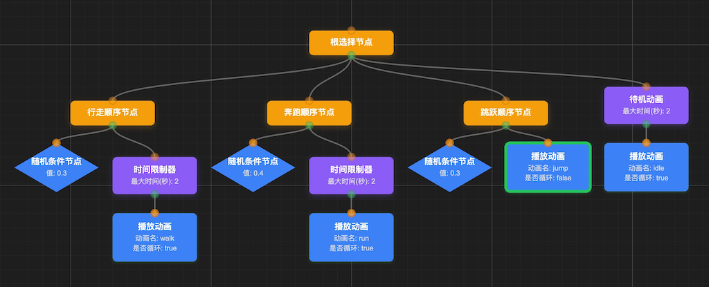
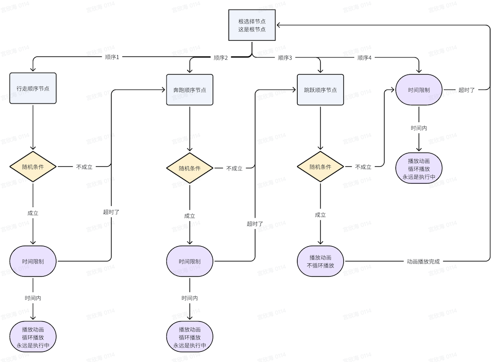

# 硬核游戏开发 - 使用BehaviorTree实现游戏AI决策的开发详解

## 一个让我头疼三个月的BOSS

去年在公司做一个RPG项目的时候，遇到了一个特别头疼的问题。策划给我扔了个需求：做一个龙王BOSS，要求这货能巡逻、能战斗、血少了会发疯、快死了还会逃跑。

听起来挺简单的，不就是几个状态切换嘛。我当时想都没想，直接上手就是一顿if-else：

按策划的文档，这个BOSS需要：
- 平时在那巡逻，看到玩家就冲过去
- 根据距离选择近战还是远程攻击  
- 血量掉到30%以下就进入狂暴模式
- 受到重击时会短暂防御
- 血量太低就开始逃跑

看起来逻辑很清楚，我就写了一大堆判断：

```javascript
function updateBoss() {
    if (boss.hp < 0.1 * boss.maxHp) {
        if (canEscape()) {
            escape();
        } else if (canDefend()) {
            defend();
        } else {
            attack();
        }
    } else if (boss.hp < 0.3 * boss.maxHp) {
        if (playerInRange()) {
            berserkerAttack();
        } else {
            moveToPlayer();
        }
    } else if (playerDetected()) {
        if (playerDistance() < 5) {
            meleeAttack();
        } else {
            rangedAttack();
        }
    } else {
        patrol();
    }
}
```

结果呢？完全是个灾难。

BOSS的表现简直让人抓狂：有时候明明看到玩家了，突然又开始巡逻；血都快没了还在那疯狂攻击；更离谱的是，防御和攻击状态之间来回切换，看起来像个神经病。

策划每天都来找我："这BOSS怎么这么蠢？"我也很绝望啊，每次改一个地方，其他地方就出新问题。最后代码写成了800多行的意大利面条，连我自己都不敢动了。

后来一个老同事看不下去了，跟我说："你试试行为树吧，专门解决这种问题的。"

花了差不多一周时间学习和重构，用行为树重新写了这个BOSS：

```
龙王BOSS行为树：
根节点（选择器）
├── 逃跑分支（血量 < 10%）
│   ├── 寻找掩体
│   └── 快速移动
├── 防御分支（受到重击）
│   ├── 播放防御动画
│   └── 恢复少量血量
├── 血怒分支（血量 < 30%）
│   ├── 进入狂暴状态
│   └── 疯狂攻击
├── 战斗分支（发现玩家）
│   ├── 距离判断
│   ├── 近战攻击 OR 远程攻击
│   └── 追击玩家
└── 巡逻分支（默认行为）
    ├── 沿路径移动
    └── 警戒四周
```

效果立竿见影！

BOSS终于不再像个智障了，行为逻辑变得很清晰。最关键的是，策划现在能直接看懂这个结构，提需求的时候也更明确了。代码从800行缩减到200多行，维护起来轻松了不少。

最让我印象深刻的是，后来策划突然说要加个"血量50%时召唤小怪"的功能，我只是在行为树里插了个新分支，十几分钟就搞定了。要是放在以前的if-else结构里，估计又得折腾好几天。

---

这就是我第一次接触行为树的经历。

如果你也在做游戏开发，特别是涉及到AI逻辑的部分，可能也遇到过类似的问题。怪物AI、NPC行为、甚至一些复杂的游戏机制，用传统的if-else或者状态机来实现，总是容易变成一团乱麻。

行为树提供了一个更好的解决方案。下面我就把这段时间学到的东西整理一下，希望能帮到有同样困扰的朋友。

## 什么是行为树

简单来说，行为树就是一种树形结构，用来描述AI的决策逻辑。

它的基本思路是这样的：从根节点开始，通过不同类型的节点来控制执行流程。比如"选择器"节点会依次尝试它的子节点，直到有一个成功为止；"序列"节点则要求所有子节点都成功才算成功。最底层的叶子节点负责执行具体的动作或者判断条件。

相比传统的状态机，行为树最大的优势是更容易组合和复用。你可以很自然地表达"先试试A，不行就试B"或者"按顺序执行1、2、3"这样的逻辑，而且特别适合做可视化编辑器。

## 行为树是怎么工作的

为了更好理解，我们来看一个简单的例子。假设你在做一个哥布林守卫的AI，它需要在洞穴门口巡逻。

### 节点的三种状态

行为树中的每个节点在执行时只会返回三种状态之一：

* **成功** - 任务完成了
* **失败** - 这条路走不通
* **运行中** - 还在执行中，需要等待

这个概念其实很好理解，就像你在做任何事情时的状态一样：要么做完了，要么做不了，要么还在做。

### 几种常用的节点类型

#### 选择器节点（Selector）

这个节点的逻辑是"依次尝试，直到成功为止"。

比如哥布林饿了，它会：
1. 先去厨房找剩菜
2. 厨房没有就去花园抓虫子  
3. 还是没有就啃树皮

选择器会从左到右依次执行子节点，只要有一个成功了就停止，返回成功。如果所有子节点都失败了，它才返回失败。

这种模式在游戏AI中特别常用，比如敌人的攻击选择：优先使用技能，技能冷却中就普通攻击，连普通攻击都不行就移动到攻击范围内。

#### 序列节点（Sequence）

这个节点的逻辑是"按顺序执行，全部成功才算成功"。

比如哥布林要做一顿饭：
1. 先洗手
2. 准备食材
3. 开火做饭
4. 享用美食

序列节点会严格按顺序执行，只有当前步骤成功了才会进行下一步。任何一步失败，整个序列就失败。

这种模式适合那些有明确步骤的任务，比如开门（检查是否有钥匙 → 走到门前 → 使用钥匙 → 推开门）。

#### 动作节点（Action）

这些是真正执行具体任务的节点：
- "巡逻10秒钟"
- "攻击敌人"
- "播放死亡动画"

动作节点会立即开始执行任务，然后根据情况返回对应的状态。有些动作是瞬时的（比如播放音效），有些需要持续一段时间（比如移动到目标点）。

#### 条件节点（Condition）

这些节点负责检查当前的环境状态：
- "敌人在视野内吗？"
- "血量低于30%吗？"
- "身上有钥匙吗？"

条件节点通常执行很快，瞬间返回成功或失败，不会有"运行中"的状态。

### 一个完整的例子

现在我们把这些节点组合起来，看看一个哥布林守卫的行为树：

```
哥布林守卫行为树：
根节点（选择器）
├── 战斗分支（序列）
│   ├── 条件：发现敌人？
│   ├── 动作：冲向敌人
│   └── 动作：攻击
├── 巡逻分支（序列）
│   ├── 条件：在巡逻路径上？
│   └── 动作：继续巡逻
└── 待机分支
    └── 动作：原地等待
```

执行过程是这样的：

1. **平时状态**：
   - 根选择器首先尝试战斗分支
   - 检查"发现敌人？" → 没有敌人，条件失败
   - 尝试巡逻分支 → 检查"在巡逻路径上？" → 是的，开始巡逻

2. **发现敌人时**：
   - 根选择器重新开始评估
   - 战斗分支：检查"发现敌人？" → 有敌人！条件成功
   - 执行"冲向敌人" → 成功后执行"攻击"

这就是行为树的核心思想：每一帧都从根节点重新开始评估，根据当前情况选择最合适的行为。

### 执行机制

行为树有个很重要的特点：它每一帧都会从根节点重新开始执行。



这张图展示了我们刚才说的哥布林行为树的结构。



执行过程就像这样：
1. 从根节点开始
2. 根据节点类型决定如何执行子节点
3. 叶子节点返回结果，层层向上传递
4. 一帧结束，下一帧重新开始

这种每帧重新评估的机制有几个好处：
- 能够实时响应环境变化
- 优先级明确，重要的行为总是先被考虑
- 调试时可以清楚看到决策过程
- 性能还不错，只执行必要的节点

当然，这种机制也有一些需要注意的地方。比如如果你的行为树很复杂，每帧都完整执行一遍可能会有性能问题。不过对于大部分游戏AI来说，这都不是问题。