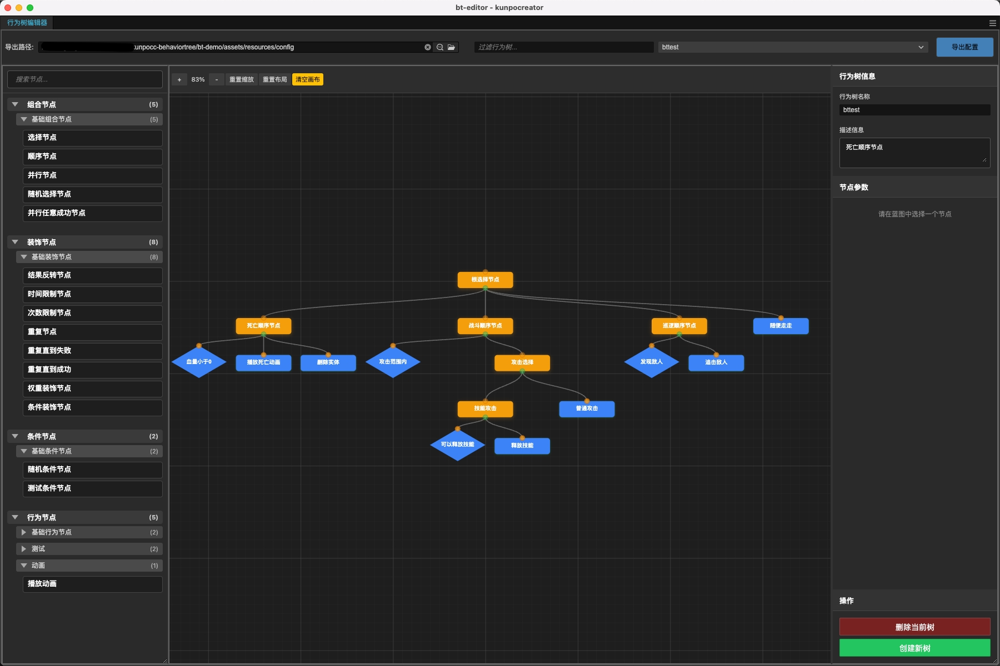

# 行为树使用指南



本指南将详细介绍如何使用 kunpocc-behaviortree 库和行为树编辑器。

## 一、开发环境
- 引擎版本：Cocos Creator 3.8.6
- 编程语言：TypeScript


- 支持引擎版本：Cocos Creator 3.7+


## 二、安装
1. 安装 kunpocc-behaviortree 
   ```
   npm install kunpocc-behaviortree
   ```
   
2. 下载扩展插件(bt-editor)

3. 项目脚本中引入库文件
    ```typescript
    // 比如在项目代码目录下添加一个文件 header.ts
    // 写上如下代码
    import * as BT from "kunpocc-behaviortree";
    export { BT };
    ```
    
4. 重启creator

5. 启用插件
   * 在 Cocos Creator 中选择 `扩展` -> `扩展管理器` -> `已安装扩展`
   * 找到 `bt-editor` 并启用
   
6. 打开扩展面板
   * 在 Cocos Creator 顶部菜单栏中选择 `kunpo` -> `行为树编辑器`

7. 创建第一颗行为树 (见下方 `导出文件使用` 部分)

    

## 三、自定义节点 (扩展编辑器节点池)

### 节点装饰器

装饰器系统是连接自定义节点和编辑器的桥梁
只有通过装饰器装饰的节点，才能在编辑器中的节点池中显示

#### @ClassAction - 行为节点装饰器

用于装饰执行具体逻辑的叶子节点。

```typescript
@BT.ClassAction("NodeName", { name: "显示名称", group: "节点分组", desc: "节点描述" })
export class MyActionNode extends BT.LeafNode {
    public tick(): BT.Status {
        // 执行逻辑
        return BT.Status.SUCCESS;
    }
}
```

#### @ClassCondition - 条件节点装饰器

用于装饰判断条件的节点。

```typescript
@BT.ClassCondition("ConditionName", { name: "条件名称", group: "条件分组", desc: "节点描述" })
export class MyCondition extends BT.Condition {
    protected isEligible(): boolean {
        // 返回判断结果
        return true;
    }
}
```

#### @ClassComposite - 组合节点装饰器

用于装饰控制子节点执行流程的组合节点。

```typescript
@BT.ClassComposite("CompositeName", { name: "组合名称", group: "组合分组",  desc: "节点描述" })
export class MyComposite extends BT.Composite {
    public tick(dt: number): BT.Status {
        // 控制子节点执行逻辑
        for (const child of this.children) {
            const status = child._execute(dt);
            if (status !== BT.Status.SUCCESS) {
                return status;
            }
        }
        return BT.Status.SUCCESS;
    }
}
```

#### @ClassDecorator - 装饰节点装饰器

用于装饰修改单个子节点行为的装饰节点。

```typescript
@BT.ClassDecorator("DecoratorName", { name: "装饰名称", group: "装饰分组", desc: "节点描述" })
export class MyDecorator extends BT.Decorator {
    public tick(dt: number): BT.Status {
        // 装饰逻辑，修改子节点行为
        return this.children[0]._execute(dt);
    }
}
```

### 节点属性装饰器 (扩展节点参数)

为节点添加可在编辑器中配置的参数。

```typescript
@BT.ClassAction("NodeName", { name: "显示名称", group: "节点分组", desc: "节点描述" })
export class MyNode extends BT.LeafNode {
    // 基础类型参数
    @BT.prop({  type: BT.ParamType.string,  description: "动画名称", defaultValue: "idle" })
    private animationName: string = "idle";

    @BT.prop({  type: BT.ParamType.float, description: "速度",  min: 0, max: 10, step: 0.1, defaultValue: 1.0 })
    private speed: number = 1.0;

    @BT.prop({  type: BT.ParamType.bool,  description: "是否循环" })
    private loop: boolean = false;

    // 对象参数
    @BT.prop({ 
        type: BT.ParamType.object, 
        description: "位置信息", 
        properties: {
            x: { type: BT.ParamType.int, min: 0 },
            y: { type: BT.ParamType.int, min: 0 }
        }
    })
    private position: { x: number, y: number };

    // 数组参数
    @BT.prop({
        type: BT.ParamType.array,
        description: "巡逻点列表",
        itemType: BT.ParamType.object,
        itemProperties: {
            x: { type: BT.ParamType.float },
            y: { type: BT.ParamType.float },
            name: { type: BT.ParamType.string }
        }
    })
    private patrolPoints: Array<{ x: number, y: number, name: string }>;
}
```

#### 参数类型详解

| 类型 | BT.ParamType | 描述 | 支持属性 |
|------|--------------|------|----------|
| 整数 | `int` | 整数类型 | `min`, `max`, `step`, `defaultValue` |
| 浮点数 | `float` | 浮点数类型 | `min`, `max`, `step`, `defaultValue` |
| 字符串 | `string` | 字符串类型 | `defaultValue` |
| 布尔 | `bool` | 布尔类型 | `defaultValue` |
| 对象 | `object` | 对象类型 | `properties` |
| 数组 | `array` | 数组类型 | `itemType`, `itemProperties` |


## 四、编辑器介绍

#### 快捷键

- **打开编辑器**: `Ctrl+Shift+K` (Windows) / `Cmd+Shift+K` (Mac)
- **导出配置**: `Ctrl+Shift+L` (Windows) / `Cmd+Shift+L` (Mac)

#### 菜单访问

在 Cocos Creator 顶部菜单栏中选择 `kunpo` -> `行为树编辑器`


### 编辑器功能介绍

行为树编辑器提供了一个直观的可视化界面，让你可以轻松创建和管理复杂的行为树结构。

#### 核心功能

##### 可视化节点编辑
- **拖拽创建**：从左侧节点库拖拽节点到画布中
- **分组管理**：节点按功能分组显示，便于查找
- **实时预览**：节点显示类型图标和描述信息

##### 属性参数配置
- **智能表单**：根据`@prop`装饰器自动生成配置界面
- **类型校验**：支持数字、字符串、布尔值、对象、数组等类型
- **默认值**：自动填充装饰器中定义的默认值
- **约束验证**：支持最小值、最大值、步长等约束条件

##### 连接线管理
- **可视连接**：通过拖拽连接点创建父子关系
- **自动布局**：连接线自动避让，保持界面整洁
- **连接验证**：防止创建非法的节点连接关系

##### 画布操作
- **缩放平移**：鼠标滚轮缩放，拖拽平移画布
- **多选操作**：支持框选多个节点进行批量操作

##### 节点管理
- **别名设置**：为节点设置有意义的别名，便于理解
- **复制粘贴**：快速复制节点及其子树结构
- **删除操作**：删除节点时自动清理相关连接

##### 编辑器界面布局

```
┌─────────────────────────────────────────────────────────────────────────────┐
│                            顶部工具栏                                         │
│   [设置导出路径] [过滤行为树] [选择行为树▼] [导出配置]                             │
├─────────────┬─────────────────────────────────────────────┬─────────────────┤
│             │                                             │                 │
│   节点库    │                                              │    右侧面板      │
│  (左侧)     │                                              │                 │
│             │  ┌───────────────────────────────────────┐  │ ┌──────────────┐│
│ • 行为节点  │  │        画布工具栏                        │  │ │  行为树名称  │ │
│ • 条件节点  │  │ [缩放] [重置] [清空] [复制] [粘贴]         │  │ │  行为树描述  │ │
│ • 组合节点  │  └─────────────────────────────────────────┘  │ └──────────────┘ │
│ • 装饰节点  │                                            │                  │
│ • 内置节点  │  ┌─────────────────────────────────────────┐  │ ┌──────────────┐ │
│            │  │                                         │  │ │              │ │
│            │  │           画布操作区                     │  │ │  节点参数区   │ │
│            │  │                                        │  │ │              │ │
│            │  │  ┌─────┐                               │  │ │ • 节点名称    │ │
│            │  │  │根节点│                               │  │ │ • 参数配置    │ │
│            │  │  └──┬──┘                               │  │ │ • 描述信息    │ │
│            │  │     │                                  │  │ │ • 别名设置    │ │
│            │  │  ┌──▼──┐ ┌──────┐                      │  │ │              │ │
│            │  │  │子节点│ │子节点│                       │  │ └──────────────┘ │
│            │  │  └─────┘ └──────┘                      │  │                  │
│            │  │                                        │  │ ┌──────────────┐ │
│            │  │                                        │  │ │ [删除行为树]   │ │
│            │  └────────────────────────────────────────┘  │ │ [创建新树]    │ │
│            │                                              │ └──────────────┘ │
└────────────┴──────────────────────────────────────────────┴──────────────────┘
```

### 导出文件使用

#### 在项目中使用导出配置

##### 1. 配置文件格式

```json
{
    "boss1": [
        {
            "id": "1758206972710_bhxebhy7o",
            "className": "Sequence",
            "parameters": {},
            "children": [
                "1758090634327_mf36nwkdt"
            ]
        },
        {
            "id": "1758090634327_mf36nwkdt",
            "className": "Selector",
            "parameters": {},
            "children": [
                "1758206988178_55b7kk5va"
            ]
        },
        {
            "id": "1758206988178_55b7kk5va",
            "className": "BTAnimation",
            "parameters": {
                "_name": "",
                "_loop": false
            },
            "children": []
        }
    ]
}
```

##### 2. 配置文件放入项目资源目录
将从编辑器导出的JSON文件放入项目资源目录
自行加载配置数据

```
assets/
├── resources/
│   └── config/
│       ├── bt_config.json      // 所有行为树的信息都在这个里边
```

##### 3. 创建行为树实例

* BT.createBehaviorTree(config["boss1"], entity);

* 函数详解

```typescript
// 工厂函数签名
function createBehaviorTree<T>(config: INodeConfig[], entity: T): BehaviorTree<T>

// 内部工作流程：
// 1. 验证配置格式
// 2. 创建节点映射表 (id -> config)
// 3. 递归创建节点树
//    - 通过className查找构造函数
//    - 根据节点类型选择创建方式
//    - 设置节点参数
//    - 建立父子关系
// 4. 返回行为树实例
```

## 五、更新声明

## 0.0.1 (2025-09-23)
- 首版本

## 六、联系作者

*  邮箱: gong.xinhai@163.com
*  微信:  G0900901
*  扫码加微信:


## 七、版权声明
此插件源代码可商业使用

商业授权范围仅限于在您自行开发的游戏作品中使用

不得进行任何形式的转售、租赁、传播等


## 八、购买须知
本产品为付费虚拟商品，一经购买成功概不退款，请在购买前谨慎确认购买内容。